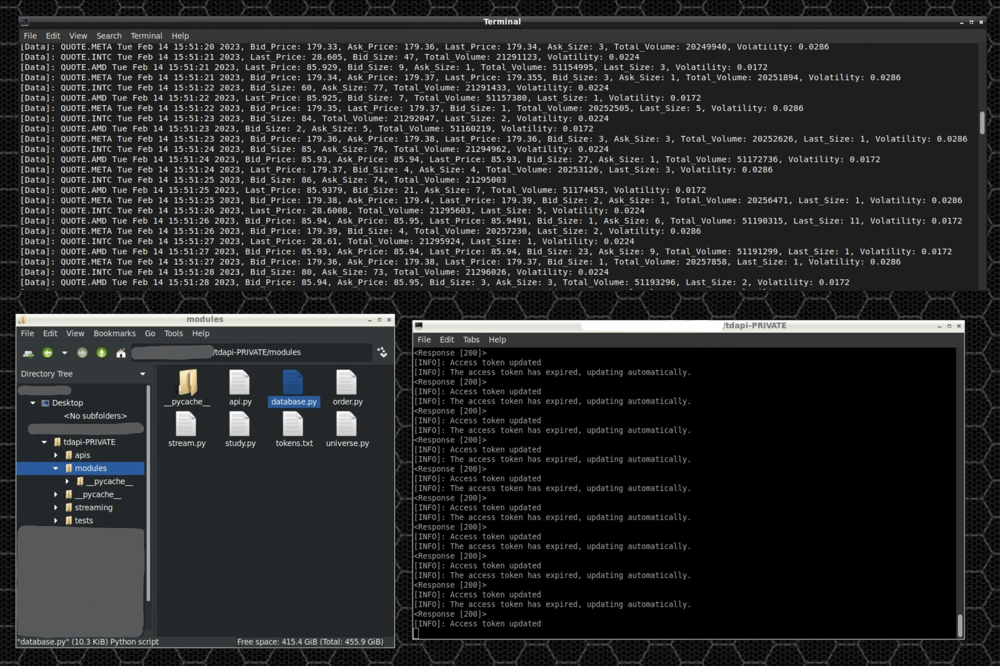

# TD-Ameritrade-API-Python-Client  
EFFECTIVE 2023 TD IS MOVING TO SCHWAB, though the future should be safe for the api.      
Next update planned for release by the end of febuary (or sooner) it will focus on storing data in a postgresql database, automatic pandas dataframes, and a rewrite of this readme.

This is an (unofficial) wrapper to make using the TD Ameritrade API easier.   
The idea is to make an easy to understand, highly-organized client for the api.    
What you need to do:      
You need to fill in your credentials in the modules/globals.py file.  
Install websockets, requests, pycron, and window-terminal (using pip)      
main.py is where all your code should go.  
api and streaming should be complete however they are not fully tested.      

Example of streaming usage:

