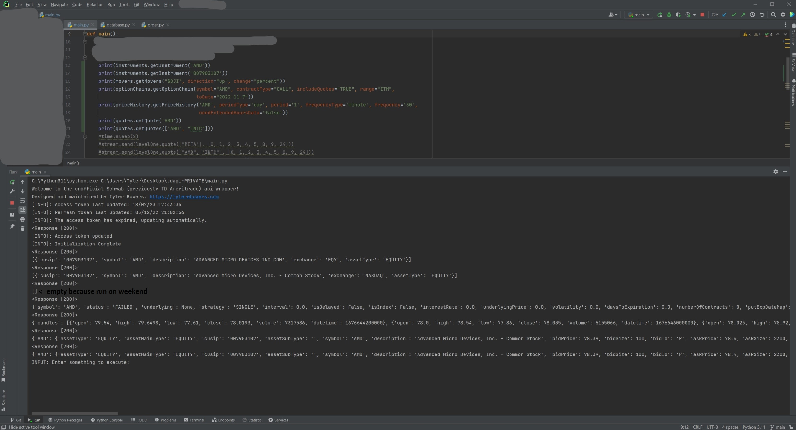

# TD-Ameritrade-API-Python-Client  
In 2023 TD is moving to schwab so some significant changes may be needed soon.     
Join the [Discord group](https://discord.gg/m7SSjr9rs9)

## Quick setup
1. `pip3 install requests pycron window-terminal websockets pandas SQLAlchemy`    
2. Review preferences and credentials in modules/universe.py (specifically consumerKey and callbackUrl)
3. Start by running from main.py

## What can this program do?
 - Access all api funtions
 - Stream all data types
 - Auto access Token updates
 - Auto Stream starting/stopping
 - Auto create database and dataframe tables
 - Auto add database and dataframe data
 ### TBD
 - Order handler / method
 - Algorithmic / Probability paper money
 - Statistics and analysis functions

## Usage and Design
This python client makes working with the TD/Schwab api easier.    
The idea is to make an easy to understand, highly-organized, and highly automatic client for the api.   
Below is a light documentation on how it works, python is pseudocode-esk so if you are confused just read the code and follow the functions. 

### Organization

The modules folder contains code for main opperations:     
 - `api.py` contains functions relating to api calls, requests, and automatic token checker daemons, works with `apis/`.
 - `database.py` contains functions for Postgresql and Pandas Dataframes. Note that adding data is normally automatic.
 - `order.py` will eventually contain functions for automaic order placing and algorithmic paper money.
 - `stream.py` handles streaming and stream data, it works closely with database and `streaming/`.
 - `tokens.txt` contains api tokens as well as dates for when they expire.
 - `universe.py` contains universal variables that need to be accessed across many functions such as credentials, preferences, tokens, DB connections, dataframes, data aliases.

The folders apis and streaming both contain supporting code which is organized acording to TD's Docs.   
 - With api calls for example, `apis/instruments.py` contains the functions `searchInstruments` and `getInstrument`; this is 1-1 to [TD's Docs](https://developer.tdameritrade.com/instruments/apis). Then in main.py these apis can be called via `from apis import instruments`... and specific functions via `instruments.getInstrument(...)`; When calling these functions api keys and access tokens are handled automatically, so in this case you only need to pass in the [CUSIP](https://developer.tdameritrade.com/instruments/apis/get/instruments/%7Bcusip%7D). Try this: `print(instruments.getInstrument('AMD'))`
 - With streaming we can send SUB requests after it has started:  `stream.send(levelOne.quote(["AMD", "INTC"], [0, 1, 2, 3, 4, 5, 8, 9, 24]))` Note that you must always send `0`. When the above line is executed several things happen: if you are using a database then a table is automatically created (no overwirite), and a dataframe is created in universe.py. While the stream is running both of these locations (DB and DF) have stream data automatically added to them. The fields that you requested 0,1,2,3, etc... have name aliases which can be found in `universe.stream.fieldAliases`
 - Both apis and streaming contain a utilities.py file which contains functions shared across internal files, they are not to be imported.

### Initialization
main.py initializes below main in `if __name__ == '__main__':` each call is described below:
 1. `api.initialize()` # This calls a function that checks if the access or refresh token need to be re-authenticated. It also addes the tokens and expire times to `universe.py`
 2. `if universe.preferences.usingDatabase: database.DBConnect()` # This connects the database using the credentials that you supplied in `universe.credentials`, it assumes that it is a postgresql database. It also loads database connection variables into `universe.py`.
 3. `api._checkTokensDaemon()` # This appends a thread to the universe threads. This thread automatically updates the access token if needed. It is highly recomended to check on the program every 85 days to check the refresh token though the expire time for the refresh token is printed every time on startup.
 4. `stream.startAutomatic()` # this appends a thread to main which will automatically start the stream in market hours and stop the stream outside of market hours. It also starts the streaming window.
 5. `stream.startManual()` # this appends a thread to main which starts the stream immediately, it is mainly intended for testing. It also starts the streaming window.
 6. `universe.threads.append(threading.Thread(target=main))` # this adds main() to the list of threads to start.
 7. The `for` loops start and join the threads.

## Screenshots
Example of streaming usage:

Example of API usage:

